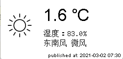

# WeatherStation

用电子墨水屏显示天气预报。买了个2.13英寸电子墨水屏，只能显示实时天气了。效果类似于：



为了开发调试方便，有两个版本：
* 主机版本：
    `python3 weather_tk.py`
* 墨水屏版本：
    `python3 weather_epaper.py`
    
## API 说明
```
感谢中央气象台的免费API，所有数据都包含在内了，只用这一个就可以了：
http://www.nmc.cn/rest/weather?stationid=54511

下面的是以前使用的API:
空气质量：http://www.nmc.cn/f/rest/aqi/54511
天气实况：http://www.nmc.cn/f/rest/real/54511
七天预报：http://www.nmc.cn/f/rest/tempchart/54511

开源天气预报api整理
https://blog.csdn.net/weixin_34410662/article/details/93535017
https://www.cnblogs.com/popqq520/p/9289331.html

查询省份列表：http://www.nmc.cn/f/rest/province 
查询城市：http://www.nmc.cn/f/rest/province/+省份id
查询实时天气：http://www.nmc.cn/f/rest/real/+城市ID
查询空气质量：http://www.nmc.cn/f/rest/aqi/+城市ID
查询过去一天天气：http://www.nmc.cn/f/rest/passed/+城市ID
查询前后一周天气：http://www.nmc.cn/f/rest/tempchart/+城市ID
查询当天天气：http://www.nmc.cn/f/rest/weather/+城市ID  #已废弃

查询天气图片:
白天：http://image.nmc.cn/static2/site/nmc/themes/basic/weather/white/day/图片id.png
夜晚：http://image.nmc.cn/static2/site/nmc/themes/basic/weather/white/night/图片id.png
图片id参照查询天气详情时img字段

day/0～33.png
night/0～33.png
65x54
下载的图片绘制时会有边框，后来发现要使用alpha通道就可以去掉边框。
有边框的地方使用了白色绘制，但是alpha是0！
```
